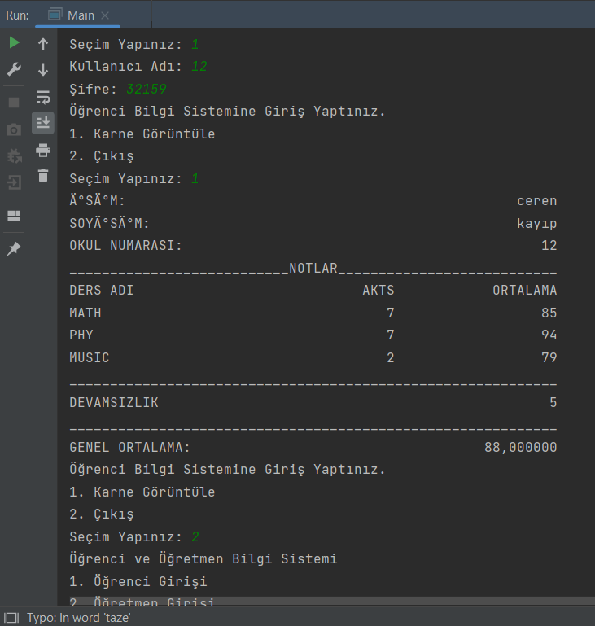

# Portal
Accessing the files in which student and teacher information is recorded, the portal is accessed by requesting the id and password of the person. The teacher can edit the grade and nonattendance of the registered student. The student can view his transcript from the system.

## Prerequisites
This project requires JDK

## Setup/Installation
1. Clone this repo into your own workspace.
2. Open the project using IDEA or VS Code
3.  Run

